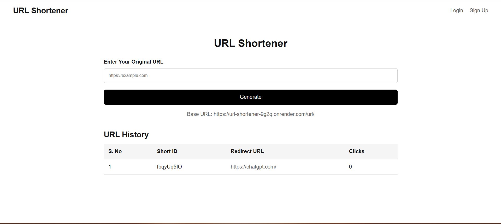

# URL-Shortener

A **full-stack URL Shortener web application** that converts long URLs into short, shareable links with built-in authentication, security, expiration, and analytics.
Designed with a **clean Controller → Service → Repository architecture** for scalability and maintainability.

---

## 🌐 Live Demo

👉 [https://url-shortener-9g2q.onrender.com](https://url-shortener-9g2q.onrender.com)

---

## 📸 Screenshots

### Dashboard & URL History



### Sign Up Page


---

## 🛠️ Tech Stack

### Backend

* Node.js
* Express.js
* MongoDB
* Mongoose

### Frontend

* EJS (Server-Side Rendering)
* HTML
* CSS

### Authentication & Security

* JWT Authentication (stored in **HTTP-only cookies**)
* Rate limiting using `express-rate-limit`

### Utilities & Tools

* dotenv
* nanoid / shortid
* nodemon

---

## ✨ Features

* 🔗 Shorten long URLs into compact links
* 🚀 Fast redirection using short URLs
* 👤 User signup and login system
* 🔐 JWT-based authentication
* 🛡️ Rate limiting to prevent abuse and brute-force attacks
* ⏳ Automatic URL expiration using MongoDB TTL indexes
* 📊 Click analytics with visit timestamps
* 📁 Per-user URL history dashboard
* 🎨 Server-rendered UI using EJS
* 🧱 Clean and scalable backend architecture

---

## 📂 Project Structure

```txt
src/
├── controllers/     # HTTP request & response handling
├── middlewares/     # Authentication, rate limiting, custom middleware
├── models/          # Mongoose schemas
├── public/          # Static assets
│   └── css/
├── routes/          # Application routes
├── services/        # Business logic layer
├── views/           # EJS templates
├── connect.js       # MongoDB connection
└── index.js         # Application entry point
```

---

## 🔐 Environment Variables

Create a `.env` file in the project root:

```env
PORT=3000
MONGO_URI=your_mongodb_connection_string
JWT_SECRET=your_jwt_secret
BaseUrl=https://url-shortener-9g2q.onrender.com/url/
```

---

## ⚙️ Installation

```bash
git clone https://github.com/Good-Slime/URL-Shortener.git
cd URL-Shortener
npm install
```

---

## ▶️ Running the Application

```bash
npm start
```

Server will be available at:

```
http://localhost:3000
```

---

## 🔄 Authentication Flow

* New users are redirected to **Sign Up**
* Existing users can log in via **Login**
* JWT is stored securely in an **HTTP-only cookie**
* Protected routes require a valid authenticated session

---

## 🚦 Rate Limiting

* Applied globally using `express-rate-limit`
* Limits excessive requests per IP
* Protects against abuse and brute-force attacks

---

## ⏳ URL Expiration

* URLs can be configured to expire automatically
* Implemented using **MongoDB TTL indexes**
* Expired URLs are removed automatically by MongoDB

---

## 📈 Analytics

* Each redirect stores a visit timestamp
* Click count is derived from visit history
* Analytics are displayed per user in the dashboard

---

## 📄 License

ISC
